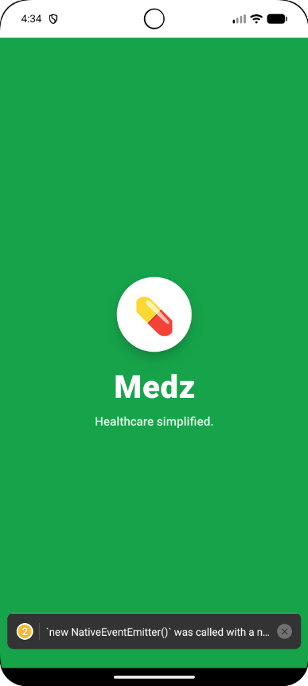
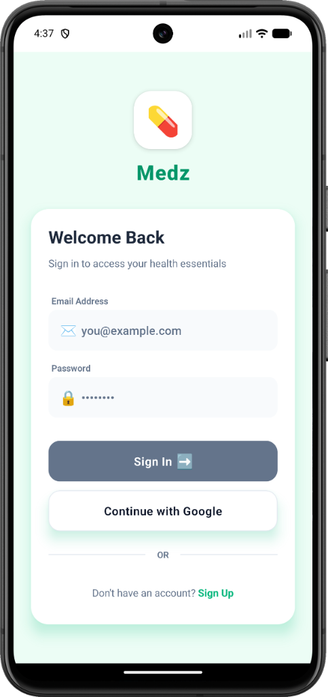
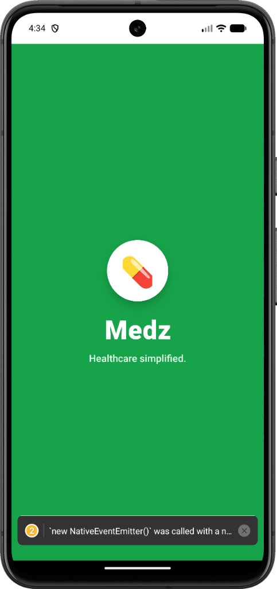
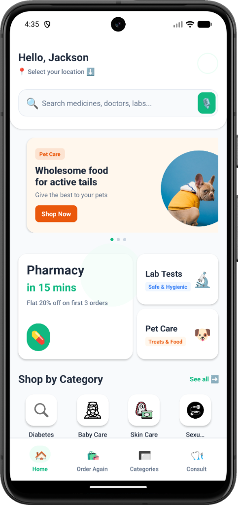
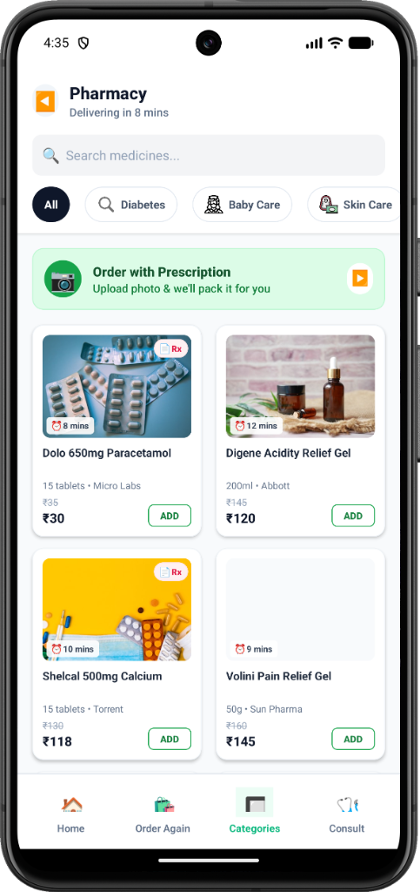

# Medz User App

A React Native healthcare application for ordering medicines, booking lab tests, and managing health essentials.

## Screenshots

  
  
  
  
  

## Features

-   **Order Medicines**: Browse and order medicines from a wide range of categories.
-   **Lab Tests**: Book diagnostic tests from certified labs.
-   **Pet Care**: Essentials for your pets.
-   **Secure Checkout**: Validation for payments and address.
-   **Live Location**: Pinpoint your exact delivery location.

## Getting Started

1.  Clone the repository.
2.  Run `npm install`.
3.  Run `npm start`.
